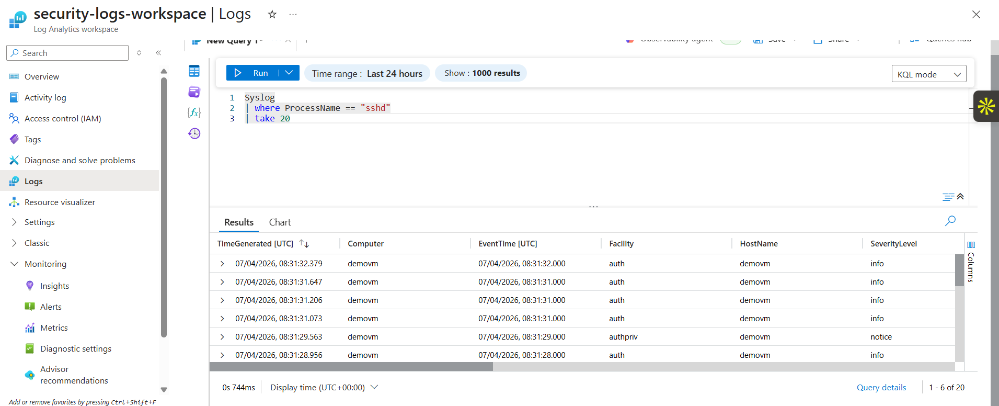
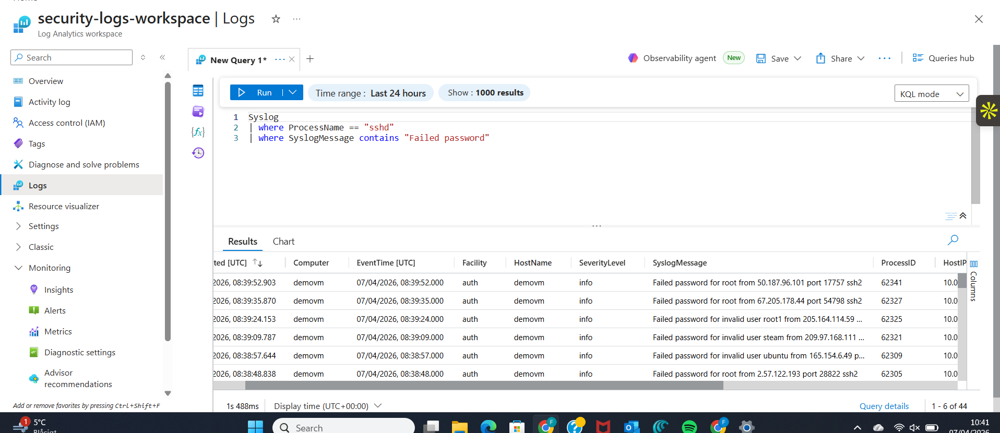
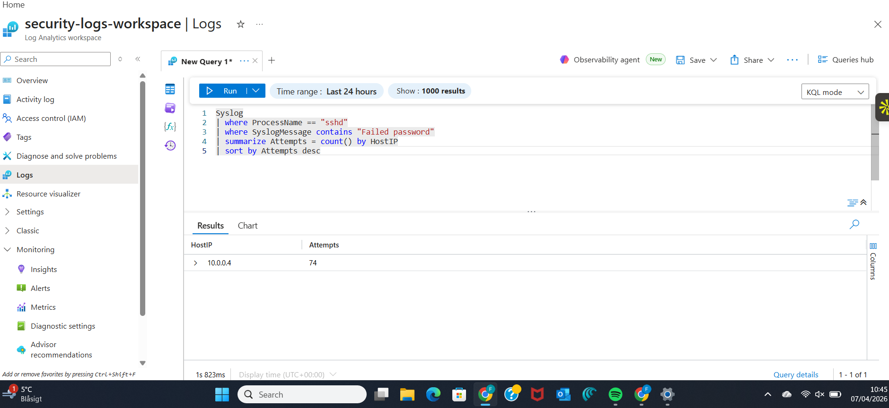
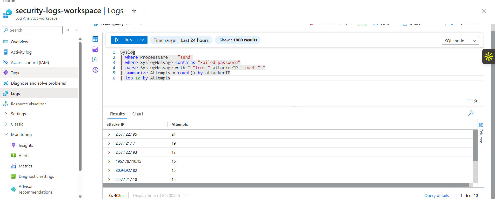

# Azure Monitor Threat Detection Lab

## Overview
This project demonstrates how to detect SSH brute-force attacks on an Azure Linux Virtual Machine using Azure Monitor, Log Analytics, and Kusto Query Language (KQL).

Logs from the Linux VM are collected using Azure Monitor Agent and sent to a Log Analytics Workspace where they are analyzed using KQL queries to identify malicious login attempts.

This lab simulates a real-world cloud security monitoring scenario where attackers attempt to brute-force SSH credentials.

---

## Architecture

Internet Attackers  
↓  
Azure Linux Virtual Machine  
↓  
Azure Monitor Agent  
↓  
Log Analytics Workspace  
↓  
KQL Threat Detection Queries  

---

## Environment Setup

The following Azure resources were deployed:

- Azure Linux Virtual Machine (Ubuntu)
- Network Security Group allowing SSH (Port 22)
- Azure Monitor Agent
- Log Analytics Workspace
- Data Collection Rule for Linux Syslog

Linux authentication logs were forwarded to Azure Log Analytics for analysis.

---

## Data Collection

Linux authentication logs were collected using **Azure Monitor Data Collection Rules (DCR)**.

### Syslog Ingestion in Log Analytics



The following Syslog facilities were enabled:

- LOG_AUTH
- LOG_AUTHPRIV
- LOG_DAEMON
- LOG_SYSLOG

These facilities capture authentication events such as SSH login attempts.

---

# Detection Queries

## 1. Failed SSH Login Detection

### Failed SSH Login Attempts

Query used to detect failed SSH login attempts in Syslog logs.





This query detects failed SSH login attempts recorded in Linux authentication logs.

```kql
Syslog
| where ProcessName == "sshd"
| where SyslogMessage contains "Failed password"
```

---

## 2. SSH Brute Force Detection

### Brute Force Detection Results


This query identifies attacker IP addresses that attempted multiple SSH logins.

```kql
Syslog
| where ProcessName == "sshd"
| where SyslogMessage contains "Failed password"
| parse SyslogMessage with * "from " attackerIP " port " *
| summarize Attempts = count() by attackerIP
| top 10 by Attempts
```

---

## 3. Brute Force Detection with Timeline

This query shows how long attackers attempted to access the system.

```kql
Syslog
| where ProcessName == "sshd"
| where SyslogMessage contains "Failed password"
| parse SyslogMessage with * "from " attackerIP " port " *
| summarize Attempts=count(), FirstSeen=min(TimeGenerated), LastSeen=max(TimeGenerated) by attackerIP
| where Attempts > 5
| sort by Attempts desc
```

---

# Findings

During monitoring, multiple external IP addresses attempted to brute-force SSH access to the Azure VM.

Attackers attempted authentication using common usernames such as:

- root
- ubuntu
- admin

Example attacker activity detected:

| Attacker IP | Attempts |
|-------------|----------|
| 2.57.122.195 | 21 |
| 2.57.121.17 | 19 |
| 2.57.122.193 | 17 |
| 80.94.92.182 | 15 |

The detection queries successfully identified repeated failed login attempts from external IP addresses.

No successful SSH login attempts from attackers were detected.

---

# Skills Demonstrated

- Azure Monitor
- Log Analytics
- Linux Syslog Monitoring
- Kusto Query Language (KQL)
- Cloud Threat Detection
- Security Monitoring
- Brute Force Attack Detection

---

# Future Improvements

Future improvements include integrating this monitoring pipeline with **Microsoft Sentinel** to create automated security alerts and SOC incident detection.

Additional improvements may include:

- Sentinel analytics rules
- automated incident response
- SOAR playbooks
